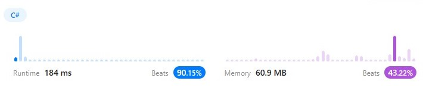

## Question
An Anagram is a word or phrase formed by rearranging the letters of a different word or phrase, typically using all the original letters exactly once.  

### Example 1:
Input: strs = ["eat","tea","tan","ate","nat","bat"]  
Output: [["bat"],["nat","tan"],["ate","eat","tea"]]  

### Example 2:
Input: strs = [""]  
Output: [[""]]  

### Example 3:
Input: strs = ["a"]  
Output: [["a"]]  

### Constraints:
1 <= strs.length <= 104  
0 <= strs[i].length <= 100  
strs[i] consists of lowercase English letters.  

## The Results of the Solutions

### The Result of the SolutonOne:

